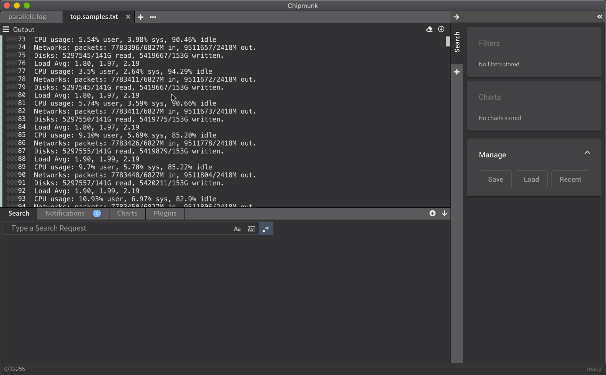

# Charts

Getting a quick overview of what happened during a 24h-trace period can be daunting if the logfiles are huge (millions of log entries). A very neat way to get a quick overview is to show some graphs for what is happening.

In this graph we captured processor workload for different cores. Any numerical value can be captured by using a regular expression with a group.

Supported are
* integers
* floats

An example for a regular expression with such a capture group looks like this:

`measured:\s(\d+)`

This will match `measured: 42` and pull out the value `42`.
Here is an example of how this looks in action.

## Create chart

Type a search request at the bottom and click the graph icon next to the search input.
> **Keyboard shortcut**: `Shift + Enter`

## Edit chart

Created charts can be modified afterwards by simply right-clicking on the desired chart and selecting `Edit`.

When the edit is done press `Enter` to apply the changes.

## Remove chart

Charts can be removed one by one by right-clicking on the chart and selecting `Remove`.

Another way is to drag&drop the chart on the bin icon at the bottom of the sidebar which appears as soon as the chart is picked up and moved around. 

To remove all created charts at once right-click on any chart and select `Remove all`.

## Convert to filter

If a chart needs to be converted into a chart, right-click on the chart and select `Convert To Filter`.

Another way to convert a chart into a filter is to drag&drop the chart in the **Filters** section on the sidebar.

## En-/Disable chart

### In search results
Charts can be en-/disabled in the search results by un-/checking the checkbox next to the corresponding chart.

### In search results and output
Charts can also be en-/disabled completely by right-clicking the corresponding chart and select `Disable`.

If the disabled area is visible due to a chart or any other search component is disabled, the chart can be dragged and dropped into the area directly.

## Save and load charts

To save the created charts and other search settings click on the `Save` button in the **Manage** section on the sidebar.

To load previously created charts and other search settings click on the `Load` button in the **Manage** section on the sidebar.
