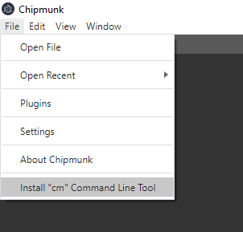

# Command Line

Here's a way to open a file with `Chipmunk` directly from the command line.

Run Chipmunk and open the `File` section of the toolbar at the top and install `cm`.

> **NOTE:** This only needs to be done once

**Now you're ready to go!**

Simply open the command line of your choice and type:

`cm [...filename]`

> **NOTE:** Opening with multiple files will result in one tab for each file
