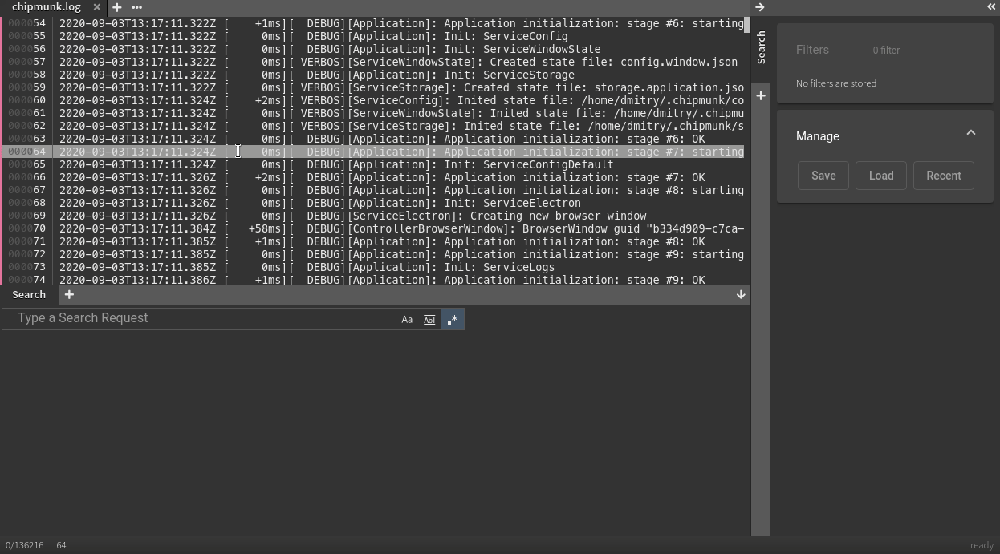

# Commenting

There might be cases when you want to add a remark to a few places in the log. Simply mark lines, right-click and select `Comment` to add a comment to the specified lines.

### Reply to comments

In addition to creating comment, you can also reply to comments with no limit.

### Colors

By changing the color of a comment the priority changes. The priority order is defined by default and cannot be changed. It is also possible to display only one specific color of comments.  

