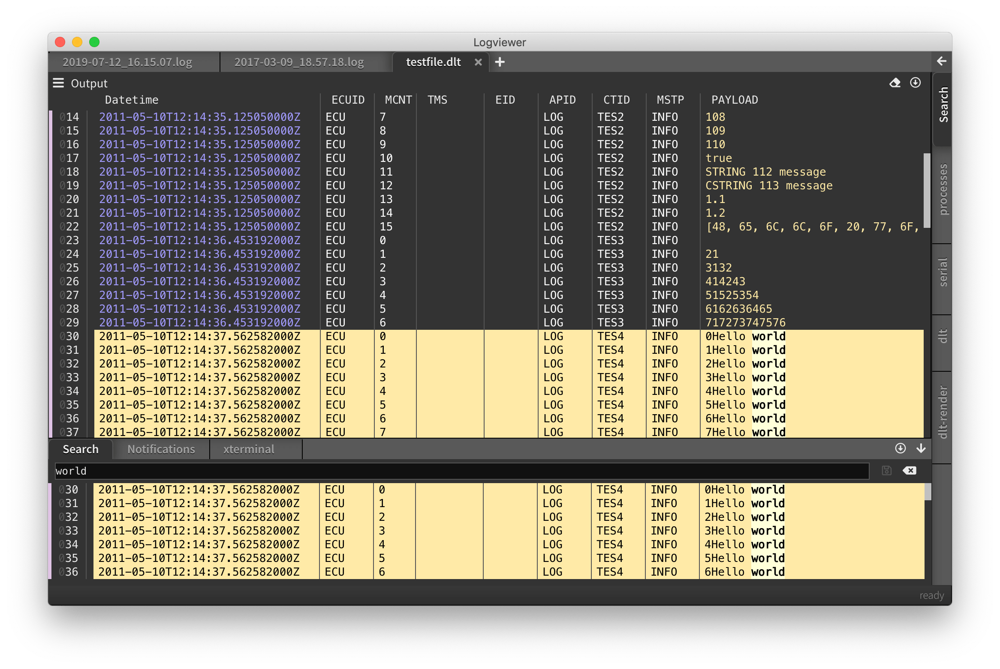
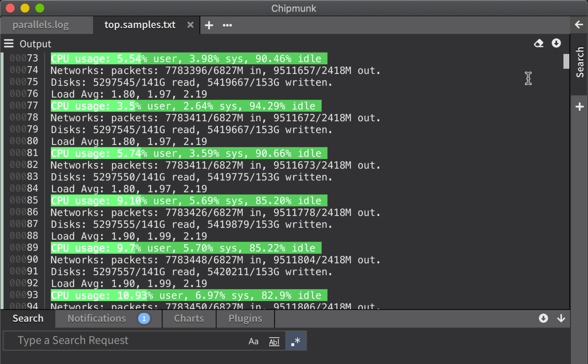

# DLT support

The Diagnostic Log and Trace AUTOSAR format is widely used in the automotive industry and is a binary log format. `chipmunk` can understand and process DLT content in large quantities.

## Import file

When opening a dlt file, you are prompted with this dialog. Here you can also provide the path to a **FIBEX** file that contains descriptions for you non-verbose messages.

This can be expanded so can select what components or loglevels you want to include. Note that you are presented with a statistics of how many log messages exist e.g. for a component with a certain log level.

The columns can be configured by right-clicking in one of the column titles or hover over one of the column titles and left-click the `...`. Then you can filter out columns and adjust colors.

