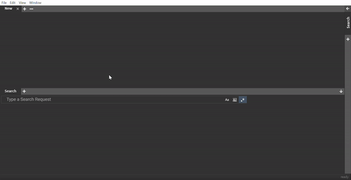

# Merging

To help developers to deal with multiple logfiles, chipmunk can automatically detect timestamps and merge logs from multiple files sorting the lines of the files by their timestamp.

Here is an animation to show how it works:

To merge files either drag and drop multiple files into the output window of `chipmunk`

> **NOTE:** It's possible to drag and drop additional files onto the dialog window.

Another option is to open the `merging` tab on the sidebar and click on `Add file(s)`.

> **NOTE:** You can select multiple files at once by clicking `Add file(s)`

Once the files are added, you have an overview of all added files and their filesize along with the detected datetime formats.

By left-clicking one of the files the details are being shown. The details display the content of the file along with the datetime format which colorizes the components to identify them easier in the content window.

The format can also be modfied by hand along with adding a year. Another option is to set the offset of a file after what time in `ms` the selected file should be included.

When the configuration and selection of the files is done, just press `Merge`.

> **NOTE:** In the output window you can still see which line is from which file by the colors or hover with the mouse over them which will show the filename.

