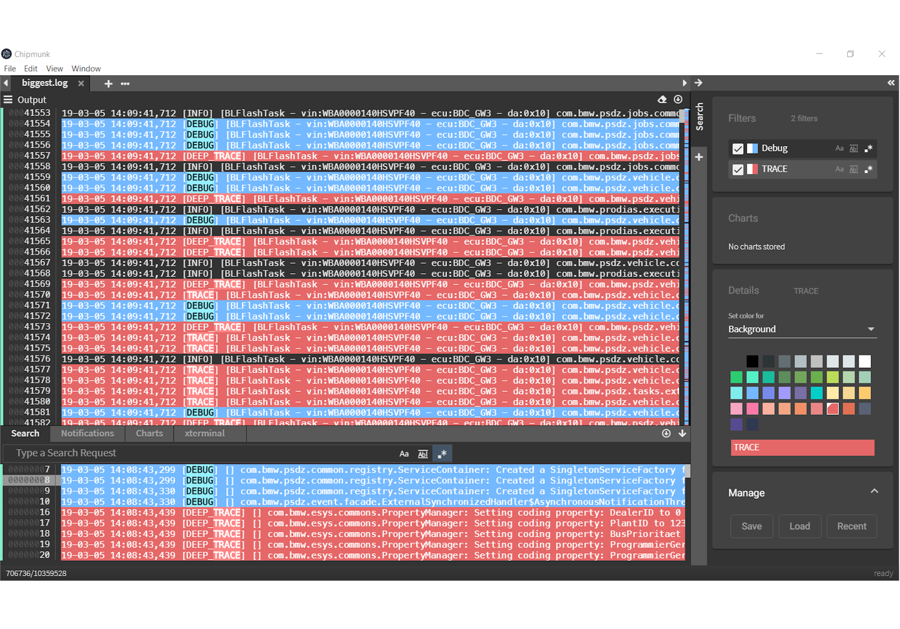
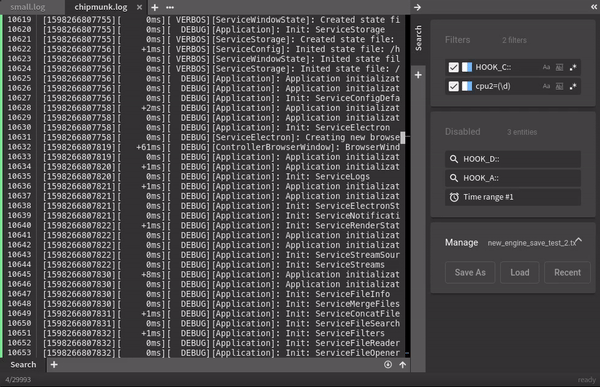
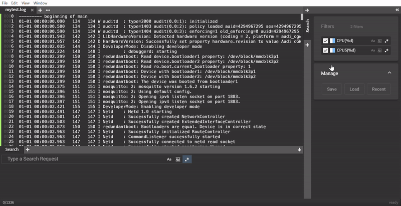

# Searching with Filters

Of course multiple searches are supported and filters can be saved and restored.

## Create filter

Type a search request at the bottom and click the floppy disc icon next to the search input.
> **Keyboard shortcut:** `Enter + Enter` or `Enter + CTRL/CMD` (depending on the OS)

## Edit filter

Created filters can be modified afterwards by simply right-clicking on the desired filter and selecting `Edit`.

When the edit is done press `Enter` to apply the changes.

## Remove filter

Filters can be removed one by one by right-clicking on the filter and selecting `Remove`.

Another way is to drag&drop the filter on the bin icon at the bottom of the sidebar which appears as soon as the filter is picked up and moved around. 

To remove all created filters at once right-click on any filter and select `Remove all`.

## Convert into chart

If a filter needs to be converted into a chart, right-click on the filter and select `Convert To Chart`.

Another way to convert a filter into a chart is to drag&drop the filter in the **Charts** section on the sidebar (only visible when at least one chart is already created).

> **Note:** This option is only available for filters that consist of regular expressions.

## Create Time Range

By selecting two or more filters time ranges can be created. To select multiple filters, hold `SHIFT` while left-clicking on the desired filters. After selecting the filters right-click on one of the selected filters and select `Create Time Range`.

> **Note:** More about Time Range <a href="#">here</a>

## En-/Disable filter

### In search results
Filters can be en-/disabled in the search results by un-/checking the checkbox next to the corresponding filter.

### In search results and output
Filters can also be en-/disabled completely by right-clicking the corresponding filter and select `Disable`.

If the disabled area is visible due to a filter or any other search component is disabled, the filter can be dragged and dropped into the area directly.

## Save and load filters

To save the created filters and other search settings click on the `Save` button in the **Manage** section on the sidebar.

To load previously created filters and other search settings click on the `Load` button in the **Manage** section on the sidebar.
