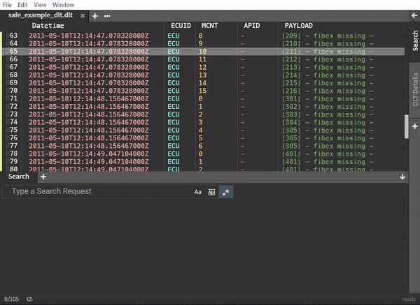

# Time Range

`Chipmunk` provides the measurement of  time that passed between lines and makes it possible to compare them in a chart.

## Create and remove time ranges

### Start time range
By right-clicking on a line either select the option `Open time measurement view` or when it already is open `Start Time Range`.

### Add time range
If you want to another time range to the current selection right-click and select `Add time range <line begin>-<line end>`.

### Close time range
The currently opened time range can be closed by right-clicking and selecting `Close time range <line begin>-<line end>`. 

### Remove time range
Time ranges can easily be removed by right-clicking on a line which is part of a time range select:

- Remove a single range: `Remove this range`
- Remove all **except the selected range**: `Remove all except selected`
- Remove all: `Remove all ranges`

## Analyze time ranges

In the tabs below select `Time Measurement` to see all of the created ranges.

On the bottom left the format to detect timestamps is shown.
On the bottom right the `...` symbol offers options to add, remove and set default timestamp formats.

### View modes

There are two modes available on viewing the charts:

1. `Scaled` (default)

Sorts the ranges by their position in the logfile and lets you scale on the ranges.

Scrolling inside the scaler changes the scaling of the view. By holding left-mouse in the **upper part** of the scaler, the scaler can be moved to view specific parts of the created ranges. By holding left-mouse in the **lower part** of the scaler, the scaler size can be change to that specific part and that marked size.

2. `Aligned`

Aligns all ranges to the left and sorts ranges by their position in the logfile.

> NOTE: To change the view mode right-click anywhere in the `Time Measurement` area and select `Switch to: ...`

