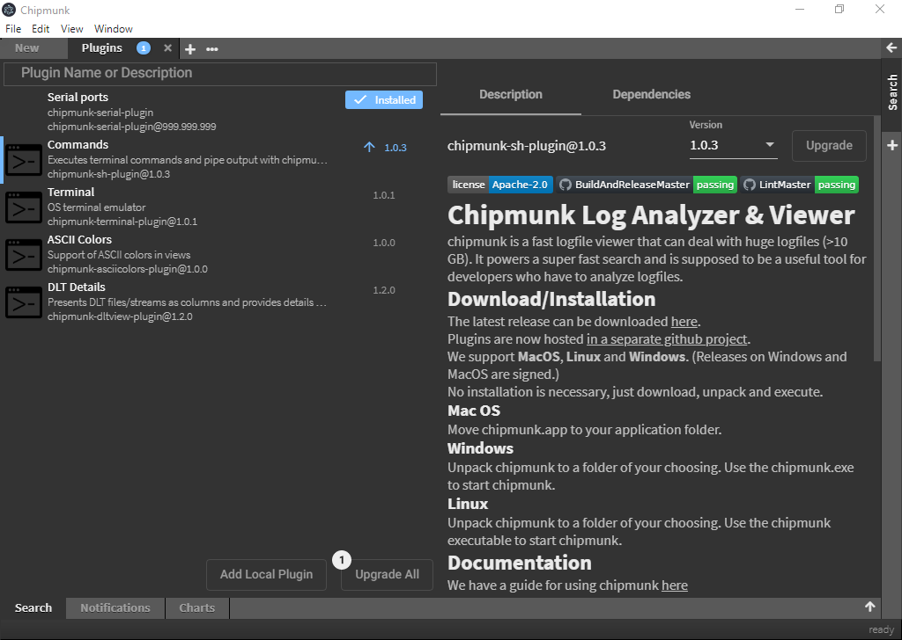

<link rel="stylesheet" type="text/css" href="../styles/styles.extension.css">

# Extending Chipmunk with plugins

In this section everything about plugins will be explained as well as how to create custom plugins for **Chipmunk**.

## About plugins

In computing, a plug-in (or plugin, add-in, addin, add-on, or addon) is a software component that adds a specific feature to an existing computer program. When a program supports plug-ins, it enables customization.[1]

Plugins in **Chipmunk** extend the default functionalities making it possible to receive and analyze data from different kind of sources (e.g. serial connections).

## Plugin structure

**Chipmunk** plugins mainly consist of a **render** and a **process** part.

### Render

The render part is responsible for the visual part of the plugin itself. With the help of Angular components are created using Typescript, HTML and CSS. The component will be automatically included in **Chipmunk** after building the plugin.

### Process

The process part is responsible for the background processing of the plugin and modifying the output stream.

## Chipmunk Store

The **Chipmunk Store** provides different plugins to install on **Chipmunk**. By simply clicking on the desired plugin and then on _install_ will add the plugin to **Chipmunk**. The **Chipmunk Store** also provides the option to upgrade the already installed plugin to a newer version.

## References

[1] https://en.wikipedia.org/wiki/Plug-in_(computing)