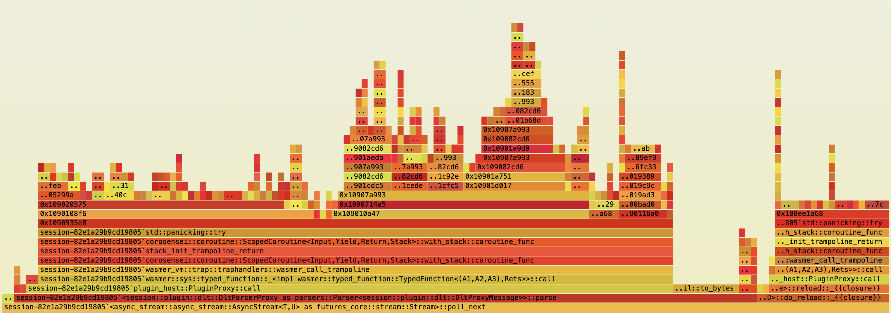

# Plugin Proposal

* The plugin framework is based on the `wasmer` runtime and it's related modules. 
* It should seemingly integrate to Chipmunk's current architecture and data processing logic.
* Different types of plugins for the diverse core components, such as the `ByteSource` and `Parser` will be used.
* For communication between host and plugins a FFI-save RPC mechanism will be used based on the `rkyv` serialization framework.
* A prototype provides a proof-of-concept and performance considerations of this approach.

## Architecture of the Plugin Framework

* Each plugin type (or `Chipmunk Extension`) is represented by a `Plugin Proxy` for the related Trait (such as `ByteSource` and `Parser`) within the host application.
* A new `Plugin Proxy` can be instantiated on demand from a corresponding `Plugin Factory` which provides the underlying infrastructure for eg. plain `wasm` plugins or plugins requiring the `wasi` system interface.
* A `Plugin Registry` (or `Plugin Runtime`, if a lifecycle for async RPC will be needed) is created on host startup with the factories for each plugin by configuration.

### Motivations

* Generic implementations of the `Plugin Factory` types, wich will be instantiated with different pre-compiled WebAssembly modules for each corresponding plugin.
* Specialized implementations of the `Plugin Proxy` types, to reflect the individual needs of the proxy to integrate with the host architecture.

### Limitations

* The prototype is neglecting any configuration of the plugin framework and only contains hard coded insertions of the plugins in certain areas of the host for a `BinaryByteSource` and the `DltParser`.
* The prototype contains some known issues on memory management and integration within the host data processing.
    * The maximum data transfer to the `wasmer` runtime per call had to be limited to `DEFAULT_READER_CAPACITY = 512 * 1024`.
    * The path of the input file for processing was hard coded as `temp.dll` within the working directory.
    * The source plugin, tries to emulate the native buffered reading of data chunks and could be optimized to avoid an additional buffering of the data within the plugin.
        * TBC: Some complex byte-sources, such as eg. for the `MDF` file format, could actually need internal buffering for the `MDF` specific pre-parsing of data-blocks.
    * The source plugin used together with a native parsers currently seems to fail on some conditions.
        * TBC: Means to improve plugin robustness and host processing integration.
    * With both source and parser plugin running, for each bulk processing of a data chunk a possible parse error at end of the chunk due incomplete data can trigger the remaining bytes of the chunk to being dropped by the `Message Producer`. 
        * TBC: Means to avoid the dropping of bytes and continued reloading from the source in this cases.

### Outcomes

`Flamegraph` of Source and Parser plugin in a command-line Chipmunk `export raw` test with a sample input file from `indexer_cli/test/dlt/test.dlt` (4.6 MB containing 30525 DLT messages):

[](flamegraph.svg?x=697&y=853)

```
session % sudo CARGO_PROFILE_RELEASE_DEBUG=true cargo flamegraph --root --release --unit-test -- tests::test_topologize_skeleton --test --nocapture --ignored run_src_and_dlt_plugin
...
running 1 test
host : new byte-source proxy<0>
proxy<0> : init source: temp.dlt
host : new dlt-parser proxy<1>
proxy<1> : init parser
proxy<0> : reload eof
host : proxy<0> stats : c-cns 30533, c-rld 18, r-ok 17, r-eof 1, r-err 0
host : proxy<1> stats : c-fn 30533, c-plg 17, p-res 30533, m-ok 30525, m-flt 0, p-inc 0, p-eof 0, p-err 8
test plugin::tests::run_src_and_dlt_plugin ... ok
```

* Source Plugin (`proxy<0>`) mirroring loaded data chunks to host:
    * c-cns: Total calls to proxy `consume` (30533 times)
    * c-rld: Actual bulk calls to plugin `reload` (18 times)
    * r-ok: Portion of `Ok` responses from plugin (17 times)
    * r-eof: Portion of `EOF` responses from plugin (1 times)
    * r-err: Portion of `Error` responses from plugin (0 times)
* Parser Plugin (`proxy<1>`) performing bulk parsing of data chunks:
    * c-fn: Total calls to proxy `parse` (30533 times)
    * c-plg: Actual bulk calls to plugin `parse` (17 times)
    * p-res: Total responses from proxy (30533 times)
    * m-ok: Portion of `Ok` responses from proxy with DLT message (30525 times)
    * m-flt: Portion of `Filtered` responses from proxy (0 times)
    * p-inc: Portion of `Incomplete` responses from proxy ( 0 times)
    * p-eof: Portion of `EOF` responses from proxy (0 times)
    * p-err: Portion of (expected) `Error` responses from proxy (8 times)
* Performance measurement of the `Message Producer` with:
    * Native Source and Parser : 101.2ms
    * Native Source and Parser plugin : 131.2ms (ca. 129.6%)
    * Source plugin and Parser plugin : 151.1ms (ca. 149,3%)

For a final performance evaluation on the actual Chipmunk application a larger input file of 400 MB and approx 1.9 Million contained DLT messages was used within an `Import DLT-File` session with:

```
host : new byte-source proxy<0>
host : new dlt-parser proxy<1>
...
host : proxy<0> stats : c-cns 1917847, c-rld 1556, r-ok 1555, r-eof 1, r-err 0
host : proxy<1> stats : c-fn 1917847, c-plg 1555, p-res 1917847, m-ok 1917072, m-flt 0, p-inc 0, p-eof 0, p-err 775
```

* Native Source and Parser : 15s
* Native Source and Parser plugin : 20s (ca. 133%)
* Source plugin and Parser plugin : 22s (ca. 147%)
