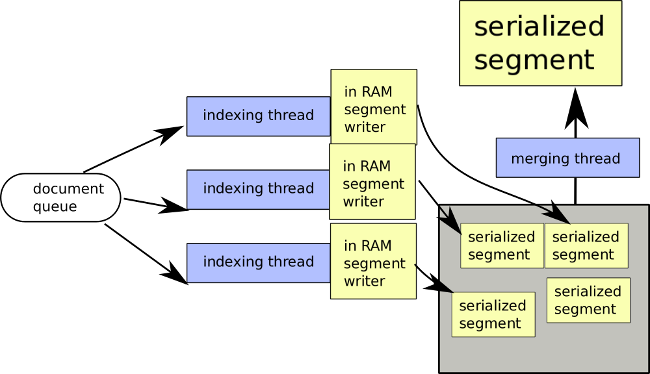

## **Tantivy**

Tantivy is a library meant to build search engines. Its architecture is strongly inspired by Lucene. It focuses mainly on full-text search. It looks to execute text queries in a large set of text documents and return N most relevant documents. To execute these queries quickly, tantivy needs to build an index beforehand. Given a large set of textual documents, and a text query, Tantivy returns the K-most relevant documents in a very efficient way. The relevance score (from Okapi BM25 - Best matching ranking function) in Tantivy is non-configurable.

**INDEXING ->**
Tantivy utilises inverted indexes which is much smaller in size than the original data itself, if we do not index positions of terms or store documents. Having compact indexes helps in allowing a large portion of the index into memory for faster retrieval while querying. The trade off here is the ability of the index to be modified easily.

Tantivy implements its indexing via multiple small indexes called segments. After indexing a bunch of files, the index directory contains a bunch of files named as "{uuid}.{ext}"
The UUID specifies the segment the file belongs to, while the extension specifies the type of data stored in the file. Each segment is a self contained index, including its own term dictionary.

After defining the schema and creating an empty index, the documents need to be added to the index. We take IndexWriter and call index_writer.add_document(doc) for each file in the path, and then call index_writer.commit(). Before calling commit, none of the documents are persisted.
Internally, when we call index_writer.add_document(doc), the document is just added to an indexing queue. The index writer handles multiple indexing threads which consume this queue. Each thread is working on building its own segment. We have no control n which segment your document will be routed to.
Every thread has a memory budget. When this budget is about to be exceeded, the indexing thread finalizes the segment, and proceeds to serialize this in-RAM representation to the disk.
The segment will never be modified now. This is called WORM : write-once-read-many strategy.
These segments need to be committed to be able to be used in search queries.

**Index files ->**
*Term dictionary(.term) file ->* This file contains each term, the number of documents containing the term (document frequency) and a pointer (or address) into the inverted index(.idx) file.
It contains the term dictionary. Term dictionary means the terms and its related metadata (document frequency, term frequency, pointers to postings list). Posting list pointers contain the DocIDs, position within the documents and byte offsets to quickly locate the posting list within other files.

    Term: "example"
    DF: 10
    TF: 50
    Pointer: (offset in postings file)

*Postings list(.pos) file ->* This file contains the term and the term positions in each document within the segment.

    Term: "example"
    Postings List: [ (DocID1, positions: [5, 20]), (DocID2, positions: [3, 8, 15]), ... ]

*Inverted Index(.idx) file ->* It contains a sorted list of document ids containing the term, term frequency in the document, pointers to the positions of the term within each document which is stored in the .pos file.

    Term: "example"
    Postings List:
        - DocID: 1, Term Frequency: 1, Positions Pointer: (positions in .pos file)
        - DocID: 2, Term Frequency: 1, Positions Pointer: (positions in .pos file)

*Doc store(.store) file ->* It contains the actual field values of the documents that are marked as stored for full document retrieval.

    DocID: 1
    Fields:
        - title: "The Old Man and the Sea"
        - author: "Ernest Hemingway"

*Field Normalization(.fieldnorm) file ->* It stores field normalization factors for each document and each field. So, for each document and each field, a normalization factor is stored in a compact binary format. Field norms are used to adjust the term frequency score during the scoring process of search queries. They ensure that longer fields do not unfairly benefit from having higher term frequencies simply due to their length. Instead, the term frequency is normalized relative to the field length.
These normalization factors are typically derived based on the length of the field. Longer fields will have lower normalization factors to prevent them from having an unfair advantage in scoring compared to shorter fields. The normalization factors are used during the scoring process to ensure fair and accurate ranking of search results.

    Document 1:
    - Field: title
      - Normalization Factor: 0.75
    - Field: body
      - Normalization Factor: 0.85

*Fast (.fast) file ->* It contains the actual values of the fast fields for each document. Metadata about the field values, such as offsets or other indexing information, is also stored to enable quick lookups. This allows Tantivy to quickly jump to the correct location in the file to retrieve the value for a particular document.

    let title = schema_builder.add_text_field("title", STRING | FAST);
    let publication_date = schema_builder.add_date_field("publication_date", INDEXED | FAST);
    let rating = schema_builder.add_i64_field("rating", INDEXED | FAST);

**Index creation process ->**
-> Schema definition of the index.
-> Document addition to the index as per the defined schema.
-> Tokenization and analysis of text fields as per the schema.
	doc1 Body: "He was an old man who fished alone..." -> ["he", "was", "an", "old", "man", "who", "fished", "alone"]
-> Creation of the inverted index by mapping terms to the documents they appear in. Writing the .term and .idx file.
-> Creating the fast fields if required and writing the .fast file.
-> Creation of the Fieldnorms and creation of .fieldnorm files.
-> Stored fields are saved for full document retrieval and writing the .store file.
-> Segment finalization is the final step where we commit the segment to disk and update the segment metadata.

Having many small segments instead of a few larger segments has a negative impact on search IO time, search CPU time, and index size.
Assuming we are building an index with 10M documents, and our individual thread heap memory limit was producing segments of around 100K documents, indexing all of the documents would produce 100 segments. This is definitely too many. For this reason, Tantivy’s index_writer continuously considers opportunities to merge segments together. The strategy used by the index_writer is defined by a MergePolicy. The merge policy by default in tantivy is called LogMergePolicy

**QUERYING ->**
First, the user query 'president obama' goes through the query parser, which will transform it into something more structured. For instance, depending on your schema configuration, the query could be transformed into (title:president OR body:president) AND (title:obama OR body:obama). The couples title:president and others are called Terms in tantivy.
-> Query construction
-> Query parsing
-> Query execution -
-> Document retrieval
-> Document deserialization

The querying process in Tantivy involves several steps that transform a user's query into a set of relevant search results. Here's a detailed explanation of each phase in the querying process:

1. Query Construction
When a user submits a query, it needs to be transformed into a format that the search engine can work with. This step involves understanding the user's intent and converting the natural language query into a structured query.

> For instance, if the user searches for "president obama", the search
> engine needs to determine how to interpret these terms within the
> context of the indexed documents.

2. Query Parsing
The query parser takes the user's query and converts it into a structured query. This involves several sub-steps:

	Tokenization: Breaking the query into individual terms.
Field Mapping: Mapping each term to the relevant fields in the schema (e.g., title, body).
Logical Operators: Determining how the terms should be combined (e.g., AND, OR).
Example
The query "president obama" might be parsed as:
(title:president OR body:president) AND (title:obama OR body:obama)
Here, title and body are fields defined in the schema, and the query parser creates logical combinations of terms across these fields.

3. Query Execution
This phase involves several steps to retrieve and score the relevant documents:

	a. Document Retrieval
Using the parsed query, the search engine scans the term dictionaries and postings lists to find documents containing the query terms. This involves:

	Term Lookup: For each term in the query, the engine looks it up in the term dictionary (.term file).
Postings List Access: Retrieves the list of document IDs (DocIDs) that contain the term from the inverted index (.idx file).
Position Information: Accesses the .pos file to get term positions within the documents, if positional data is relevant for the query (e.g., phrase queries).
b. Scoring
Documents are scored based on the relevance of the query terms within them. Tantivy uses the Okapi BM25 ranking function, which considers:

	Term Frequency (TF): The number of times a term appears in a document.
Inverse Document Frequency (IDF): A measure of how common or rare a term is across all documents.
Field Normalization: Adjusts the term frequency based on the length of the field to prevent longer fields from having an undue advantage.
Example
For a document containing "president" and "obama" in the title and body fields:

	Calculate the TF and IDF for each term.
Combine these with normalization factors to compute a BM25 score for the document.
4. Document Deserialization
After retrieving the relevant documents, they need to be deserialized, which means converting the stored document data into a usable format.

	a. Stored Fields Retrieval
Fields marked as stored in the schema (e.g., title, author) are retrieved from the .store file. This involves:

	Reading the .store File: Extracting the field values based on document IDs.
Constructing the Document: Building the full document from the retrieved fields.
5. Result Compilation
Once the documents are retrieved and scored, the search engine compiles the results:

	Sorting: Sort the documents based on their BM25 scores, from highest to lowest.
Filtering: Apply any additional filters specified in the query (e.g., date ranges, specific field values).
Limiting: Return the top N results as specified by the query.
Example
If the query requests the top 10 documents for "president obama", the search engine will sort all matched documents by their relevance scores and return the top 10.

	Search Workflow Summary
	User Input: The user enters a query.
Query Parsing: The query parser converts the user's input into a structured query.
Index Scanning: The search engine scans the index to find documents matching the query terms.
Scoring: Documents are scored based on relevance using BM25.
Deserialization: Relevant documents are deserialized from the stored fields.
Result Compilation: The top N results are sorted and returned to the user.
Example Walkthrough
Let’s walk through a detailed example of the query "old man":

*Query Construction:*

> User input: "old man".

Query Parsing:

> Parsed as: (title:old OR body:old) AND (title:man OR body:man).

Index Scanning:

Term Lookup:

> Look up "old" in the term dictionary, get the postings list. Look up
> "man" in the term dictionary, get the postings list.

Postings List Access:

> Retrieve DocIDs from the inverted index for "old" and "man". Access
> the .pos file for term positions if necessary.

Scoring:

> Calculate BM25 scores for documents containing "old" and "man".
> Document 1: TF(old), IDF(old), TF(man), IDF(man), field norms.
> Document 2: TF(old), IDF(old), TF(man), IDF(man), field norms.

Deserialization:

> Retrieve stored fields (title, body) for the relevant documents from
> the .store file. Construct full documents for display.

Result Compilation:

> Sort documents by BM25 scores. Return the top N results to the user.

